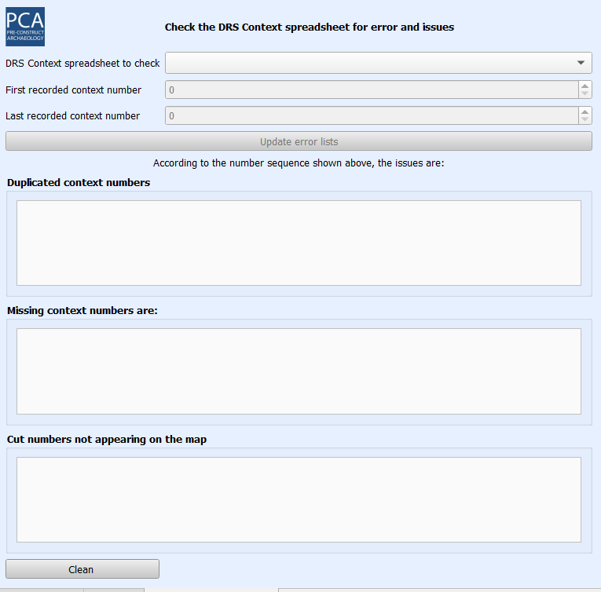

<h1>PCA DRS Context Checks QGIS Plugin</h1>

This plugin provides a quick access to an array of queries built for check the PCA DRS Context spreadsheet during the post-excavation phase.

	
It is a component of the new DRS/GIS integrated data management system. 

It provides a dockable panel that allows to run some checks, as missing context sheets, duplicated context numbers and recorded features not matching the site plan.

